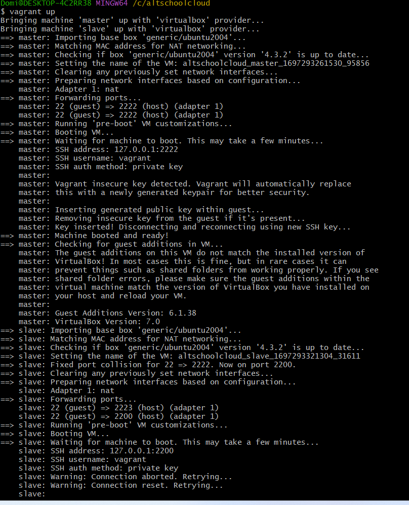
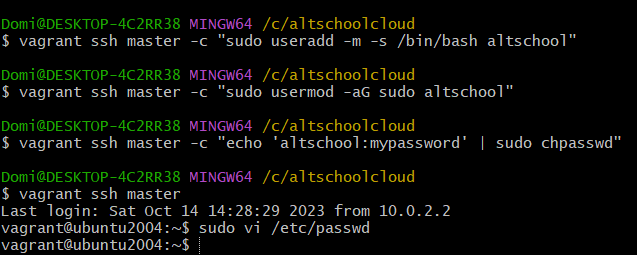
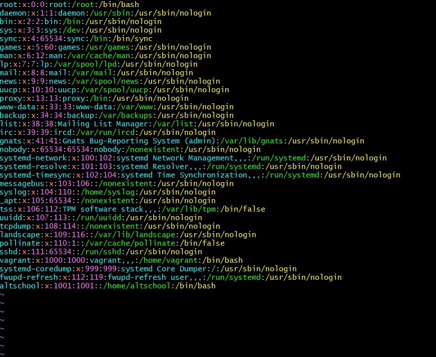

## Task 1

Infrastructure Configuration:
Deploy two Ubuntu systems:
Master Node: This node should be capable of acting as a control system.
Slave Node: This node will be managed by the Master node.


```bash
Vagrant.configure("2") do |config|
  config.vm.box = "generic/ubuntu2004"

  # Master node
  config.vm.define "master" do |master|
    master.vm.provider "virtualbox" do |vb|
      vb.memory = "2048"
    end
    master.vm.network "private_network", ip: "192.168.20.10"
    # Use a unique host port for SSH forwarding on the master machine
    master.vm.network :forwarded_port, guest: 22, host: 2222 
  end

  # Slave node
  config.vm.define "slave" do |slave|
    slave.vm.provider "virtualbox" do |vb|
      vb.memory = "2048"
    end
    slave.vm.network "private_network", ip: "192.168.20.15"
    # Use another unique host port for SSH forwarding on the slave machine
    slave.vm.network :forwarded_port, guest: 22, host: 2223
  end
end

```
above is the vagrant file configuration

## Bash Script for task 1
```bash
  vagrant up
```
## Screenshot 1



## Task 2

User Management:
On the Master node:
Create a user named altschool.
Grant altschool user root (superuser) privileges.


## bash Script for task 2
```bash
vagrant ssh master -c "sudo useradd -m -s /bin/bash altschool"
vagrant ssh master -c "sudo usermod -aG sudo altschool"
vagrant ssh master -c "echo 'altschool:mynewpassword' | sudo chpasswd"
```

## Screenshot 2


## Screenshot 2.1



## Screenshot 3


## Task 3

Inter-node Communication:
Enable SSH key-based authentication:
The Master node (altschool user) should seamlessly SSH into the Slave node without requiring a password.

## bash Script for task 3 
```bash

# Create altschool user on slave
vagrant ssh slave -c "sudo useradd -m -s /bin/bash altschool"

vagrant ssh slave -c "sudo usermod -aG sudo altschool"
vagrant ssh slave -c "echo 'altschool:your_password' | sudo chpasswd"


# Generate SSH key pair on master
vagrant ssh master -c "sudo -u altschool ssh-keygen -t rsa"

vagrant ssh master -c "echo '10.0.2.15 slave' | sudo tee -a /etc/hosts"

vagrant ssh master -c "sudo -u altschool ssh-copy-id altschool@10.0.2.15"

# Copy public key from master to slave
vagrant ssh master -c "sudo -u altschool cat /home/altschool/.ssh/id_rsa.pub" | vagrant ssh slave -c "sudo -u altschool sh -c 'cat >> /home/altschool/.ssh/authorized_keys'"

# Set proper permissions on master
vagrant ssh master -c "sudo chown -R altschool:altschool /home/altschool/.ssh && sudo chmod 700 /home/altschool/.ssh && sudo chmod 600 /home/altschool/.ssh/id_rsa"

# Test SSH connection from master to slave
vagrant ssh master -c "sudo -u altschool ssh altschool@slave"

```


## Task 4

Data Management and Transfer:
On initiation:
Copy the contents of /mnt/altschool directory from the Master node to /mnt/altschool/slave on the Slave node. This operation should be performed using the altschool user from the Master node.


## bash script for task 4

```bash
 Copy contents from master to slave
# Create the directory on master
vagrant ssh master -c "sudo mkdir -p /mnt/altschool  && sudo chown altschool:altschool /mnt/altschool"

# Create a text file with the specified content
vagrant ssh master -c "echo 'Hello, welcome to altschool cloud.' | sudo tee /mnt/altschool/welcome.txt"
vagrant ssh slave -c "sudo mkdir -p /mnt/altschool && sudo chown altschool:altschool /mnt/altschool"

vagrant ssh master -c "sudo -u altschool scp -o StrictHostKeyChecking=no /mnt/altschool/welcome.txt altschool@slave:/mnt/altschool/"


```

## Task 5

Process Monitoring:
The Master node should display an overview of the Linux process management, showcasing currently running processes.

```bash
  vagrant ssh master -c "htop"
```

## Task 6

LAMP Stack Deployment:
Install a LAMP (Linux, Apache, MySQL, PHP) stack on both nodes:
Ensure Apache is running and set to start on boot.
Secure the MySQL installation and initialize it with a default user and password.
Validate PHP functionality with Apache.

# On Master
```bash

#!/bin/bash

# Update package information
vagrant ssh master -c "sudo apt update"

# Install Apache web server, MySQL Server, PHP, and required modules
vagrant ssh master -c "sudo apt install -y apache2 mysql-server php libapache2-mod-php php-mysql"

# Start Apache and MySQL services
vagrant ssh master -c "sudo service apache2 start"
vagrant ssh master -c "sudo service mysql start"

# Enable Apache and MySQL to start on boot
vagrant ssh master -c "sudo systemctl enable apache2"
vagrant ssh master -c "sudo systemctl enable mysql"

# Secure MySQL installation and initialize it with a default user and password
vagrant ssh master -c "sudo mysql_secure_installation <<EOF
y
~yVG#uh8ZSgdGZm
~yVG#uh8ZSgdGZm
y
y
y
y
EOF"

# Validate PHP functionality with Apache
vagrant ssh master -c "echo '<?php phpinfo(); ?>' | sudo tee /var/www/html/info.php"

# Display server IP address
master_ip=$(vagrant ssh master -c "ip addr show eth0 | grep 'inet ' | awk '{print $2}' | cut -d '/' -f 1")
echo "Master IP Address: $master_ip"

# Update Apache configuration with ServerName
vagrant ssh master -c "sudo bash -c 'echo \"ServerName localhost\" >> /etc/apache2/apache2.conf'"
vagrant ssh master -c "sudo service apache2 restart"

# Display IP address of the 'master' machine
vagrant ssh master -c "ip addr show eth0 | grep 'inet ' | awk '{print \$2}' | cut -d '/' -f 1"


```

# On slave

```bash
# Update package information
vagrant ssh slave -c "sudo apt update"

# Install Apache web server, MySQL Server, PHP, and required modules
vagrant ssh slave -c "sudo apt install -y apache2 mysql-server php libapache2-mod-php php-mysql"

# Start Apache and MySQL services
vagrant ssh slave -c "sudo service apache2 start"
vagrant ssh slave -c "sudo service mysql start"

# Enable Apache and MySQL to start on boot
vagrant ssh slave -c "sudo systemctl enable apache2"
vagrant ssh slave -c "sudo systemctl enable mysql"

# Secure MySQL installation and initialize it with a default user and password
vagrant ssh slave -c "sudo mysql_secure_installation <<EOF
y
~yVG#uh8ZSgdGZm
~yVG#uh8ZSgdGZm
y
y
y
y
EOF"

# Validate PHP functionality with Apache
vagrant ssh slave -c "echo '<?php phpinfo(); ?>' | sudo tee /var/www/html/info.php"

# Display server IP address
slave_ip=$(vagrant ssh slave -c "ip addr show eth0 | grep 'inet ' | awk '{print $2}' | cut -d '/' -f 1")
echo "Slave IP Address: $slave_ip"

# Update Apache configuration with ServerName
vagrant ssh slave -c "sudo bash -c 'echo \"ServerName localhost\" >> /etc/apache2/apache2.conf'"
vagrant ssh slave -c "sudo service apache2 restart"

# Display IP address of the 'slave' machine
vagrant ssh slave -c "ip addr show eth0 | grep 'inet ' | awk '{print \$2}' | cut -d '/' -f 1"

```


