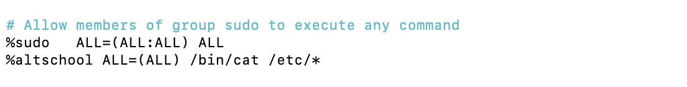

# altschool-cloud


# Altschool Cloud first assignment

user creation and permission


## task 1

create a user

to create a user you use this command
This presupposes that you have either logged into your Linux server or established an SSH connection to your Ubuntu server.


Note: you are creating user with access to the home directory


 run the following command

```bash
  sudo useradd -m alade
```


## Screenshot 1


Adding a password for the user


```bash
  sudo passwd alade
```

## Screenshot 1b


```
## task 2
set an expiry date of 2weeks for the user

run the following command

```bash
  sudo chage -E $(date -d "+14 days" +%Y-%m-%d) alade
```

## Screenshot 2


Explanation

Chage : This is a command in Linux used to manage user password expiry information

-E: This option is used with the chage command to specify the new expiration date for the user's password.

calculates a date that is 14 days from the current date

Confirmation :
To confirm that the change worked,Run this

```bash
  sudo chage -l alade
```

## Screenshot 3


## question 3

prompt the user to change there password on login

run the following command

```bash
 sudo chage -d 0 alade

```

## Screenshot 4


explanation :

-d 0 : This option is used with the chage command to specify the "last password change" date. In this case, 0 indicates the current date, meaning the date when the command is executed.

To confirm this

switch to the user created by running this command

```bash
 sudo su alade

```

## Screenshot 5


here it prompts the user to change password
## question 4

attach the user to a group called altschool
allow altschool group to be able to run only cat command on /etc/

steps:
first create the group altschool

```bash
 sudo groupadd altschool

```
## Screenshot 5


attach the user

```bash
 sudo usermod -a -G altschool alade

```

## Screenshot 6


to confirm,run this

```bash
 id alade

```

## Screenshot 7


to allow group to run cat command

```bash
 sudo visudo

```
## Screenshot 8


add this rule

```bash
 %altschool ALL=(ALL) /bin/cat /etc/*


```

## Screenshot 9



Explanation :

visudo: This is a utility that provides a safe and controlled way to edit the sudoers file. It opens the sudoers file in a text editor (usually vi by default, but you can change it) and performs syntax checking after you've made your changes. If there are syntax errors in the sudoers file, visudo will prevent you from saving the changes, helping you avoid potentially locking yourself out of the system.

once done click ctrl x to save

To confirm your change :

switch to user alade and run this command

```bash
 sudo cat /etc/passwd

```

it should show this :

## Screenshot 10


P.S
This was before the user was attached to the group,just to show that the configuration change worked

## Screenshot 11


## question 5

create another user. make sure that this user doesn't have a home directory.

run this command

```bash
 sudo useradd temi

```

## Screenshot 12


add a password

## Screenshot 12


to confirm this

run this command :

```bash
 sudo ls -al /home

```

user temi doesnt have a home directory

## Screenshot 1

